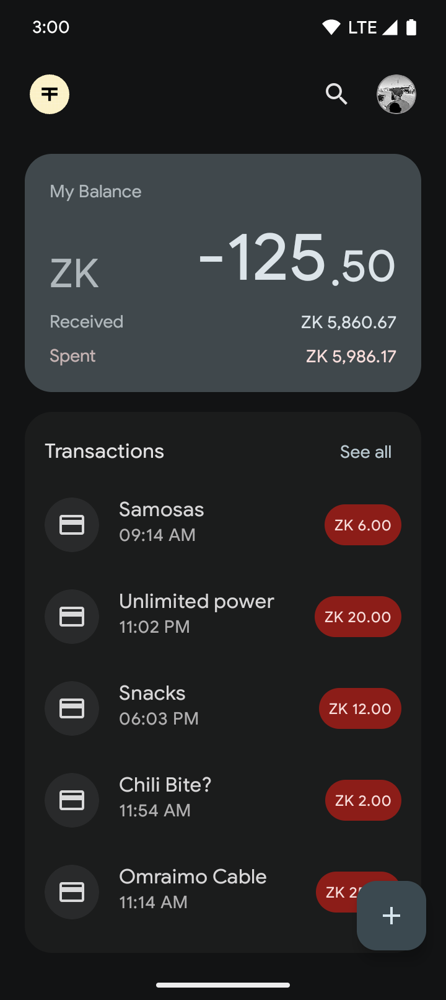
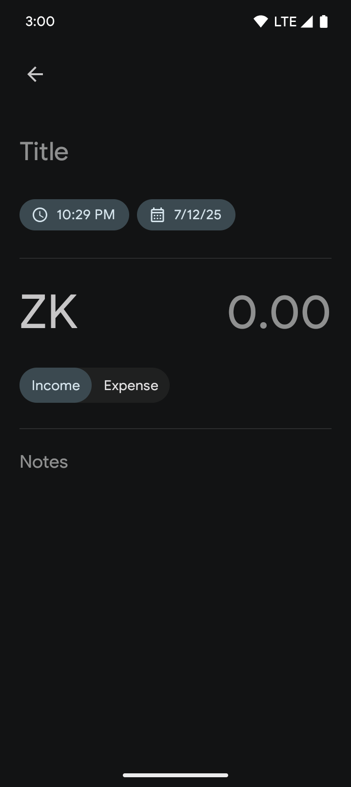
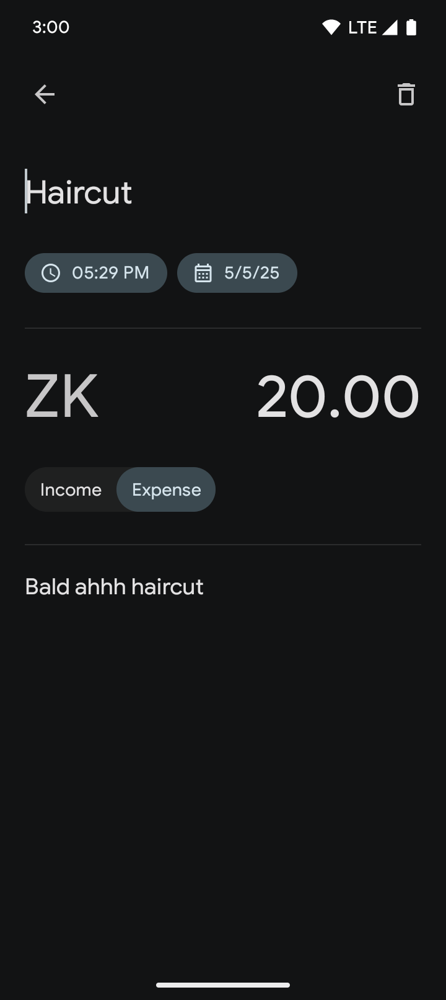
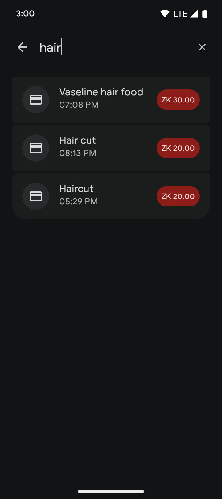
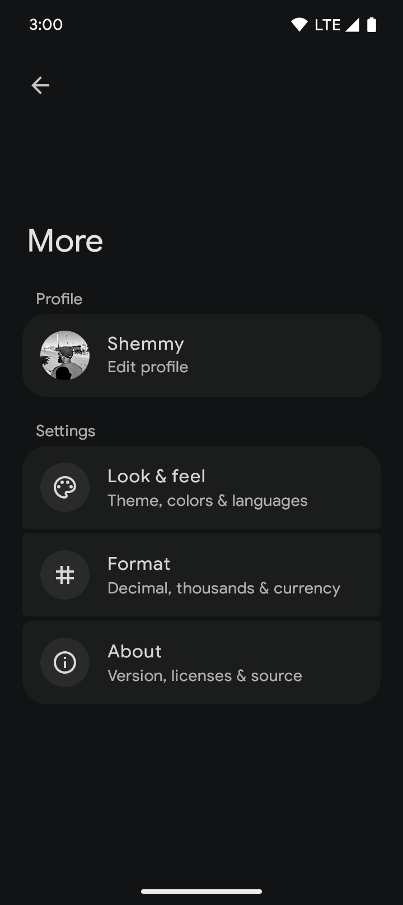
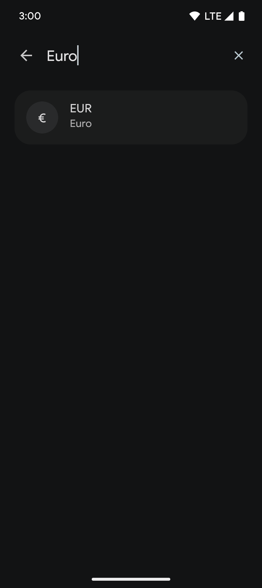

<h1>
    Coffre
     
    
        
Personal Finance Made Simple

    
</h1>

Coffre is a simple and intuitive Android application designed to help you manage your personal
finances effectively. Track your income, expenses, and transfers with ease, gain insights into your
spending habits, and achieve your financial goals.

## Screenshots

  

    
    
    
    
    
    
  

## Features

- Balance calculations
- Record transaction
- View & edit recorded transactions
- Delete transaction
- Search through recorded transaction
- Set currency
- Profile Avatar
- Completely offline
- Persists transaction
- Material Design 3 interface
- Material You support

## Download

- Find the latest <strong>stable</strong> version
  from [GitHub releases](https://github.com/N3Shemmy3/Coffre/releases/latest)

## Contact

Join our [Telegram Channel](https://t.me/N3Shemmy3) for discussion, announcements, and releases!

## Contributing

Contributions are welcome! Please follow these steps:

1. Fork the repository.
2. Create a new branch for your feature or bug fix: `git checkout -b feature/my-new-feature` or
   `git checkout -b bugfix/my-bug-fix`
3. Make your changes and commit them with clear and concise messages.
4. Push your changes to your fork: `git push origin feature/my-new-feature`
5. Create a pull request to the main branch of the original repository.

## Support the project

I maintain this project in my free time, if you find it useful consider sending me a coffee.

Scan the QR code or copy the address to donate:

  

    
    
<strong>Bitcoin (BTC)</strong> <code>12XZvVjSRbpJG8mBCWz46swDrDwxCTcKAM</code>

  

  

    
    
<strong>Ethereum (ETH)</strong> <code>0xe6916037bb01d596c78f01974a21942ead928618</code>

  

  

    
    
<strong>Litecoin (LTC)</strong> <code>LWHmZyJ6a7xJQ77YFz1q2RkvBeivy6Em5z</code>

  

Thank you for your generosity!

## License

> [!Warning]
>
> Except for the source code licensed under the GPLv3 license,
> all other parties are prohibited from using Coffre's name as a finance tracking app,
> and the same is true for Coffre's derivatives.
> Derivatives include but are not limited to forks and unofficial builds.
> And must all include the same license
